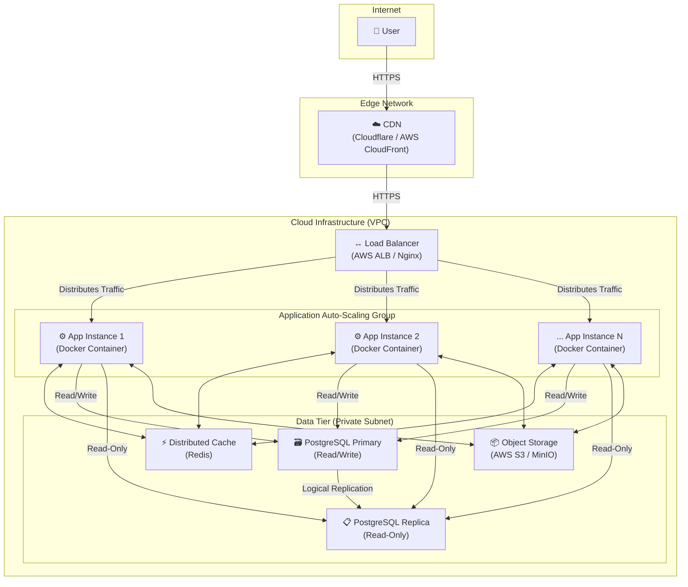

Tuyệt vời! Dưới đây là phiên bản `README.md` hoàn chỉnh đã được cải tiến toàn diện. Tôi đã cấu trúc lại, bổ sung chi tiết, giải thích sâu hơn về lý do lựa chọn kỹ thuật, và làm cho nó trở thành một tài liệu kiến trúc thực thụ mà một Senior Engineer sẽ tự hào đưa vào dự án.

---

# **QuizMaster - Nền tảng Quiz Hiệu suất cao**

[](https://github.com)
[](https://opensource.org/licenses/MIT)

**QuizMaster** không chỉ là một ứng dụng Quiz thông thường. Đây là một dự án được xây dựng với tư duy về một hệ thống vững chắc, có khả năng đáp ứng lượng truy cập lớn. Dự án tuân thủ kiến trúc **"Well-Structured Monolith"** (Monolith có cấu trúc tốt), đảm bảo tốc độ phát triển nhanh trong giai đoạn đầu nhưng vẫn sẵn sàng cho việc mở rộng quy mô (scaling) trong tương lai.

## **Mục lục**

1.  [Tính năng Chính](#1-tính-năng-chính)
2.  [Stack Công nghệ](#2-stack-công-nghệ)
3.  [Sơ đồ Kiến trúc Hệ thống](#3-sơ-đồ-kiến-trúc-hệ-thống)
4.  [Phân tích Sâu về Kiến trúc (Architectural Deep Dive)](#4-phân-tích-sâu-về-kiến-trúc-architectural-deep-dive)
    *   [CDN (Content Delivery Network)](#cdn)
    *   [Load Balancer](#load-balancer)
    *   [Application Instances (Stateless Monolith)](#application-instances)
    *   [Database Cluster (Primary-Replica)](#database-cluster)
    *   [Distributed Cache (Redis)](#distributed-cache)
    *   [Object Storage (S3/MinIO)](#object-storage)
5.  [Lý giải Lựa chọn Thiết kế: Tại sao lại là Monolith?](#5-lý-giải-lựa-chọn-thiết-kế-tại-sao-lại-là-monolith)
6.  [Bắt đầu: Hướng dẫn Cài đặt Local](#6-bắt-đầu-hướng-dẫn-cài-đặt-local)
7.  [Quy trình Triển khai (Deployment)](#7-quy-trình-triển-khai-deployment)
8.  [Tài liệu API](#8-tài-liệu-api)

## **1. Tính năng Chính**

*   **Xác thực người dùng:** Đăng ký, đăng nhập an toàn sử dụng JWT.
*   **Làm Quiz:** Người dùng có thể tham gia các bài quiz, trả lời câu hỏi và nộp bài.
*   **Xem kết quả:** Hệ thống tự động chấm điểm và hiển thị kết quả chi tiết.
*   **Quản lý (Admin):** Tạo, cập nhật, xóa các bài quiz và câu hỏi.

## **2. Stack Công nghệ**

| Lĩnh vực | Công nghệ | Lý do lựa chọn |
| :--- | :--- | :--- |
| **Backend** | Java 17, Spring Boot 3.x | Hệ sinh thái mạnh mẽ, hiệu suất cao, cộng đồng lớn. |
| **Bảo mật** | Spring Security 6 + JWT | Tiêu chuẩn ngành để bảo mật REST API. |
| **Dữ liệu** | Spring Data JPA, Hibernate | Trừu tượng hóa tầng truy cập dữ liệu, giảm code boilerplate. |
| **Database** | PostgreSQL 15+ | Hệ quản trị CSDL quan hệ mạnh mẽ, đáng tin cậy, hỗ trợ tốt JSON. |
| **Cache** | Redis | Cache tốc độ cao cho session và dữ liệu thường xuyên truy cập. |
| **Build & Dependencies** | Maven | Quản lý project và thư viện một cách hiệu quả. |
| **DevOps** | Docker, Kubernetes (K8s) | Container hóa để nhất quán môi trường, điều phối để tự động scale. |
| **API Docs** | OpenAPI 3 (Swagger) | Tự động sinh tài liệu API, giúp việc tích hợp dễ dàng. |

## **3. Sơ đồ Kiến trúc Hệ thống**

Sơ đồ này mô tả cách các thành phần tương tác với nhau trong môi trường production để đảm bảo tính sẵn sàng cao và khả năng mở rộng.



## **4. Phân tích Sâu về Kiến trúc (Architectural Deep Dive)**

#### **CDN**
*   **Vai trò:** Là cửa ngõ đầu tiên, phân phối nội dung tĩnh trên toàn cầu.
*   **Lý do:**
    *   **Tốc độ:** Cache các tài sản (assets) như CSS, JS, hình ảnh tại các vị trí gần người dùng, giảm độ trễ (latency) một cách đáng kể.
    *   **Giảm tải:** Giảm hàng nghìn request không cần thiết đến server ứng dụng, giúp server tập trung vào việc xử lý logic động.
    *   **Bảo mật:** Cung cấp lớp bảo vệ chống lại các cuộc tấn công DDoS cơ bản.

#### **Load Balancer**
*   **Vai trò:** "Cảnh sát giao thông" thông minh, phân phối request đến các instance ứng dụng.
*   **Lý do:**
    *   **Khả năng mở rộng ngang (Horizontal Scaling):** Cho phép chúng ta chạy nhiều bản sao của ứng dụng. Khi traffic tăng, chỉ cần thêm instance, Load Balancer sẽ tự động chia tải.
    *   **Tính sẵn sàng cao (High Availability):** Tự động thực hiện "Health Check". Nếu một instance bị lỗi, nó sẽ bị loại khỏi pool và traffic được chuyển hướng đến các instance khỏe mạnh, đảm bảo hệ thống không bị gián đoạn.

#### **Application Instances (Stateless Monolith)**
*   **Vai trò:** "Bộ não" của hệ thống, chứa toàn bộ logic nghiệp vụ, được đóng gói trong Docker.
*   **Lý do (Thiết kế Stateless):**
    *   **Nguyên tắc Vàng để Scale:** Mỗi instance là độc lập và không lưu trữ bất kỳ trạng thái nào của người dùng (như session). Điều này cho phép Load Balancer gửi các request liên tiếp của cùng một người dùng đến các instance khác nhau mà không gây ra vấn đề.
    *   **Tập trung hóa Trạng thái:** Toàn bộ trạng thái được đẩy ra các dịch vụ chuyên dụng: session được lưu trong Redis, file upload được lưu trên S3.
    *   **Nhất quán & Dễ thay thế:** Mọi instance đều được tạo từ cùng một Docker image. Nếu một instance lỗi, nó có thể bị hủy và thay thế bằng một instance mới ngay lập tức.

#### **Database Cluster (Primary-Replica)**
*   **Vai trò:** Trái tim lưu trữ dữ liệu, được tối ưu cho các workload đọc nhiều.
*   **Lý do:**
    *   **Tối ưu hóa Đọc/Ghi:** Hầu hết các ứng dụng web có tỷ lệ đọc cao hơn nhiều so với ghi. Mô hình này tách biệt hai loại workload.
    *   **Primary (Master):** Chịu trách nhiệm cho tất cả các hoạt động **ghi** (INSERT, UPDATE, DELETE), đảm bảo tính toàn vẹn dữ liệu.
    *   **Replica(s) (Slave):** Là các bản sao chỉ đọc, xử lý tất cả các hoạt động **đọc** (SELECT). Chúng ta có thể thêm nhiều replica để tăng khả năng đọc của hệ thống mà không ảnh hưởng đến hiệu suất ghi.

#### **Distributed Cache (Redis)**
*   **Vai trò:** Bộ nhớ đệm tốc độ cao, giảm thiểu truy cập vào database.
*   **Lý do:**
    *   **Tăng tốc API:** Lưu trữ kết quả của các query tốn kém hoặc dữ liệu ít thay đổi (VD: chi tiết 1 bài quiz, bảng xếp hạng). Truy cập dữ liệu từ RAM nhanh hơn hàng chục lần so với từ disk của DB.
    *   **Quản lý Session:** Là nơi lưu trữ session tập trung, một yêu cầu bắt buộc cho kiến trúc stateless.

#### **Object Storage (S3/MinIO)**
*   **Vai trò:** Kho lưu trữ chuyên dụng cho các file nhị phân (ảnh, video, etc.).
*   **Lý do:**
    *   **Hiệu quả & Kinh tế:** Rẻ và hiệu quả hơn nhiều so với việc lưu trữ file lớn dưới dạng BLOB trong database hoặc trên hệ thống file của server.
    *   **Độ bền cao & Dễ tích hợp:** Các dịch vụ này được thiết kế để đảm bảo dữ liệu không bị mất và cung cấp API dễ dàng để upload/download.

## **5. Lý giải Lựa chọn Thiết kế: Tại sao lại là Monolith?**

Trong thế giới tôn vinh Microservices, việc lựa chọn Monolith là một quyết định kỹ thuật có chủ đích, đặc biệt phù hợp cho giai đoạn đầu và giữa của dự án.

1.  **Tốc độ Phát triển (Development Velocity):** Một codebase duy nhất giúp giảm sự phức tạp trong việc thiết lập môi trường, debug, và triển khai. Team có thể tập trung 100% vào việc xây dựng tính năng và đưa sản phẩm ra thị trường nhanh hơn.
2.  **Đơn giản trong Vận hành (Operational Simplicity):** Quản lý và giám sát một ứng dụng đơn giản hơn nhiều so với việc phải duy trì một hệ sinh thái gồm nhiều services, network, và các cơ chế giao tiếp phức tạp.
3.  **Hiệu năng Cao (Out-of-the-box Performance):** Giao tiếp giữa các module bên trong monolith là các lời gọi phương thức trực tiếp (in-memory), có độ trễ gần như bằng không, so với các lời gọi mạng (network overhead) trong Microservices.
4.  **Đây không phải là ngõ cụt:** Nhờ cấu trúc module rõ ràng (tách biệt theo domain) và kiến trúc triển khai stateless, khi hệ thống phát triển đủ lớn, chúng ta có thể **tiến hóa** một cách từ từ, tách các module quan trọng ra thành Microservices riêng mà không cần phải viết lại toàn bộ hệ thống.

> **Triết lý:** "Bắt đầu với Monolith, tách ra thành Microservices chỉ khi nỗi đau do Monolith gây ra lớn hơn nỗi đau do Microservices mang lại."

## **6. Bắt đầu: Hướng dẫn Cài đặt Local**

#### **Yêu cầu:**
*   Java JDK 17+
*   Apache Maven 3.8+
*   Docker & Docker Compose

#### **Các bước cài đặt:**
1.  **Clone repository:**
    ```bash
    git clone https://your-repo-url.git
    cd quizmaster-app
    ```

2.  **Cấu hình Môi trường:**
    Tạo một file `.env` từ file mẫu để cấu hình các biến môi trường cho Docker.
    ```bash
    cp .env.example .env
    ```
    *Mở file `.env` và tùy chỉnh các giá trị nếu cần (VD: `POSTGRES_PASSWORD`).*

3.  **Khởi chạy các Dịch vụ Nền (Database & Cache):**
    Lệnh này sẽ khởi chạy PostgreSQL và Redis trong các container Docker.
    ```bash
    docker-compose up -d
    ```
    *`-d` để chạy ở chế độ nền (detached).*

4.  **Chạy ứng dụng Spring Boot:**
    Ứng dụng sẽ đọc cấu hình từ file `src/main/resources/application.yml` để kết nối đến các dịch vụ trong Docker.
    ```bash
    mvn spring-boot:run
    ```

5.  **Truy cập ứng dụng:**
    *   **Ứng dụng:** `http://localhost:8080`
    *   **Tài liệu API (Swagger UI):** `http://localhost:8080/swagger-ui.html`

## **7. Quy trình Triển khai (Deployment)**

Quy trình triển khai được tự động hóa thông qua CI/CD (Continuous Integration/Continuous Deployment).

1.  **Commit & Push:** Developer push code lên nhánh `main` (hoặc tạo Pull Request).
2.  **CI (Continuous Integration):**
    *   Một dịch vụ CI (GitHub Actions, Jenkins) sẽ tự động được kích hoạt.
    *   Nó sẽ build code, chạy toàn bộ unit test và integration test.
3.  **Build & Push Image:** Nếu CI thành công, một Docker image mới sẽ được build và đẩy lên một Container Registry (AWS ECR, Docker Hub).
4.  **CD (Continuous Deployment):**
    *   Một hệ thống CD (ArgoCD, Spinnaker) sẽ nhận diện image mới.
    *   Nó sẽ thực hiện một "Rolling Update" trên môi trường Production (Kubernetes), cập nhật các instance một cách từ từ mà không gây gián đoạn dịch vụ.

## **8. Tài liệu API**

Tài liệu API được tự động tạo bằng OpenAPI 3. Sau khi chạy ứng dụng, bạn có thể truy cập và tương tác với các endpoint tại:

**[http://localhost:8080/swagger-ui.html](http://localhost:8080/swagger-ui.html)**
