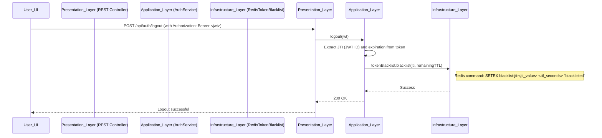

---

# **Quizz App: In-Depth Design & Architecture Document**

**Version:** 1.0  
**Date:** 09/10/025

## **1. Introduction**

This document provides a comprehensive technical design for the Quizz App platform. It details the system's architecture, core business workflows, data models, and security considerations. The design is based on **Domain-Driven Design (DDD)** principles and a **4-Layered Architecture** to build a robust, scalable, and maintainable system.

---

## **2. Architectural Vision**

The architecture is designed to enforce a strict separation of concerns, ensuring that the complex business logic is isolated from infrastructure details.

### **2.1. The Four Layers**

*   **Presentation Layer (API Gateway):** The outermost layer, responsible for handling all external communication via REST APIs and WebSockets. It translates incoming requests into commands for the Application Layer and formats domain objects into DTOs for responses. It is completely unaware of business rules.

*   **Application Layer (Use Case Orchestrator):** This layer coordinates the execution of application use cases. It acts as a transactional boundary. It retrieves domain aggregates, invokes their business methods, and uses repositories to persist their state. It contains no business logic itself.

*   **Domain Layer (The Business Core):** The heart of the system. It contains all the business logic, rules, and state, modeled as Aggregates, Entities, and Value Objects. This layer is completely independent of any external frameworks or technologies, making it the most valuable and enduring part of the application.

*   **Infrastructure Layer (Technical Implementation):** This layer provides the technical "plumbing." It contains implementations for interfaces defined in the upper layers, such as repositories (using Spring Data JPA), real-time notifiers (using WebSockets), and caching services (using Redis).

### **2.2. Key Design Principles**
*   **Domain-Centric:** The design starts from the business domain, not the database or UI.
*   **Dependency Inversion Principle:** High-level modules (Domain, Application) do not depend on low-level modules (Infrastructure). Both depend on abstractions (interfaces).
*   **Command-Query Responsibility Segregation (CQRS) - Lite:** While not a full CQRS implementation, we separate operations that change state (Commands, handled by Aggregates) from those that read state (Queries, which can use optimized read models).

---

## **3. Core Business Workflows & Logic Flows**

The system is defined by two primary modes of operation, each modeled by a distinct Domain Aggregate.

### **3.1. Live Game Mode (High-Interaction, Teacher-Led)**

*   **Primary Aggregate:** `LiveSession`
*   **Objective:** To create a real-time, engaging quiz game where the teacher controls the pace.

#### **Workflow 1: Hosting a Session**
```mermaid
sequenceDiagram
    participant Teacher_UI
    participant Presentation_Layer (REST Controller)
    participant Application_Layer (LiveSessionAppService)
    participant Domain_Layer (LiveSession Aggregate)
    participant Infrastructure_Layer (Repository, RoomCodeGenerator)

    Teacher_UI->>Presentation_Layer: POST /api/sessions/host (quizId)
    Presentation_Layer->>Application_Layer: hostNewSession(HostSessionCommand)
    Application_Layer->>Infrastructure_Layer: generateUniqueCode()
    Infrastructure_Layer-->>Application_Layer: Returns unique RoomCode
    Application_Layer->>Domain_Layer: LiveSession.create(quizId, hostId, roomCode)
    Note right of Domain_Layer: State: CREATED
    Domain_Layer-->>Application_Layer: Returns new LiveSession instance
    Application_Layer->>Infrastructure_Layer: liveSessionRepository.save(session)
    Infrastructure_Layer-->>Application_Layer: Success
    Application_Layer-->>Presentation_Layer: Returns Session DTO (with RoomCode)
    Presentation_Layer-->>Teacher_UI: 201 Created (RoomCode: "AB12CD")
```

#### **Workflow 2: Student Joining the Session**
```mermaid
sequenceDiagram
    participant Student_UI
    participant Presentation_Layer (REST Controller)
    participant Application_Layer (LiveSessionAppService)
    participant Domain_Layer (LiveSession Aggregate)
    participant Infrastructure_Layer (Repository, WebSocket Notifier)

    Student_UI->>Presentation_Layer: POST /api/sessions/join (roomCode, nickname)
    Presentation_Layer->>Application_Layer: joinSession(JoinSessionCommand)
    Application_Layer->>Infrastructure_Layer: liveSessionRepository.findByRoomCode(roomCode)
    Note right of Application_Layer: Optimistic/Pessimistic lock can be applied here.
    Infrastructure_Layer-->>Application_Layer: Returns LiveSession Aggregate
    Application_Layer->>Domain_Layer: session.addParticipant(studentId, nickname)
    Note right of Domain_Layer: Business Rule Check:<br/>1. Is session state CREATED?<br/>2. Is nickname unique?
    Domain_Layer-->>Application_Layer: Success (publishes ParticipantJoinedEvent)
    Application_Layer->>Infrastructure_Layer: liveSessionRepository.save(session)
    Application_Layer->>Infrastructure_Layer: eventNotifier.notifyHost(ParticipantJoinedEvent)
    Infrastructure_Layer-->>Teacher_UI: WebSocket push: "New participant joined: JohnDoe"
    Application_Layer-->>Presentation_Layer: Returns Success DTO
    Presentation_Layer-->>Student_UI: 200 OK (Redirect to waiting screen)
```

#### **Workflow 3: Teacher Starts a Question**
```mermaid
sequenceDiagram
    participant Teacher_UI
    participant Presentation_Layer (WebSocket Controller)
    participant Application_Layer (LiveSessionAppService)
    participant Domain_Layer (LiveSession Aggregate)
    participant Infrastructure_Layer (Repository, WebSocket Broadcaster)

    Teacher_UI->>Presentation_Layer: WebSocket SEND /ws/session/{id}/next-question
    Presentation_Layer->>Application_Layer: displayNextQuestion(sessionId)
    Application_Layer->>Infrastructure_Layer: liveSessionRepository.findById(sessionId)
    Infrastructure_Layer-->>Application_Layer: Returns LiveSession Aggregate
    Application_Layer->>Domain_Layer: session.displayNextQuestion()
    Note right of Domain_Layer: Business Logic:<br/>1. Increment question index<br/>2. Set state to QUESTION_DISPLAYED<br/>3. Record start time<br/>4. Publish QuestionDisplayedEvent
    Application_Layer->>Infrastructure_Layer: liveSessionRepository.save(session)
    Application_Layer->>Infrastructure_Layer: eventBroadcaster.broadcastToRoom(QuestionDisplayedEvent)
    Infrastructure_Layer-->>All_Students_UI: WebSocket push: {question, options, timer}
    Note right of All_Students_UI: UI starts countdown.
```

#### **Workflow 4: Student Submits an Answer & Leaderboard Update**
This flow combines two steps for brevity.
```mermaid
sequenceDiagram
    participant Student_UI
    participant Presentation_Layer (WebSocket Controller)
    participant Teacher_UI
    participant Application_Layer (LiveSessionAppService)
    participant Domain_Layer (LiveSession Aggregate)
    participant Infrastructure_Layer (Repository, WebSocket Broadcaster)

    Student_UI->>Presentation_Layer: WebSocket SEND /ws/session/{id}/answer (answer)
    Presentation_Layer->>Application_Layer: acceptAnswer(AnswerCommand)
    Application_Layer->>Infrastructure_Layer: liveSessionRepository.findById(sessionId)
    Infrastructure_Layer-->>Application_Layer: Returns LiveSession Aggregate
    Application_Layer->>Domain_Layer: session.acceptAnswer(studentId, answer, timeTaken)
    Note right of Domain_Layer: Business Rule: Check if time has expired.
    Application_Layer->>Infrastructure_Layer: liveSessionRepository.save(session)
    
    %% Timer expires or teacher ends question %%
    
    Teacher_UI->>Presentation_Layer: WebSocket SEND /ws/session/{id}/end-question
    Presentation_Layer->>Application_Layer: endCurrentQuestion(sessionId)
    Application_Layer->>Infrastructure_Layer: liveSessionRepository.findById(sessionId)
    Infrastructure_Layer-->>Application_Layer: Returns LiveSession Aggregate
    Application_Layer->>Domain_Layer: session.calculateScoresAndEndQuestion()
    Note right of Domain_Layer: Logic:<br/>1. Calculate scores for all received answers<br/>2. Update participant total scores<br/>3. Regenerate leaderboard<br/>4. Publish LeaderboardUpdatedEvent
    Application_Layer->>Infrastructure_Layer: liveSessionRepository.save(session)
    Application_Layer->>Infrastructure_Layer: eventBroadcaster.broadcastToRoom(LeaderboardUpdatedEvent)
    Infrastructure_Layer-->>All_Participants_UI: WebSocket push: {leaderboardData}
```

### **3.2. Exam Mode (Scheduled, Formal Assessment)**

*   **Primary Aggregate:** `ExamSession`
*   **Objective:** To provide a formal, timed assessment environment.

#### **Workflow 1: Scheduling an Exam**
This is a simple CRUD-like operation. A teacher sends a request with `quizId`, `scheduledStartTime`, and `durationInMinutes`. An `ExamSession` is created in the `SCHEDULED` state and saved to the database.

#### **Workflow 2: Exam Lifecycle (Start, In Progress, Auto-Submit)**
```mermaid
sequenceDiagram
    participant Scheduler (Infrastructure)
    participant Application_Layer (ExamSessionAppService)
    participant Domain_Layer (ExamSession Aggregate)
    participant Infrastructure_Layer (Repository, WebSocket Broadcaster)

    %% Step 1: Exam starts automatically %%
    Scheduler->>Application_Layer: checkAndStartExams()
    Application_Layer->>Infrastructure_Layer: repository.findExamsToStart(currentTime)
    loop For each due exam
        Application_Layer->>Domain_Layer: exam.start()
        Note right of Domain_Layer: Logic:<br/>1. Set state to IN_PROGRESS<br/>2. Record actualStartTime<br/>3. Publish ExamStartedEvent
        Application_Layer->>Infrastructure_Layer: repository.save(exam)
        Application_Layer->>Infrastructure_Layer: eventBroadcaster.broadcastToRoom(ExamStartedEvent)
    end
    Infrastructure_Layer-->>Students_UI: WebSocket push: "Exam has started!"
    
    %% Step 2: Student makes submission during exam %%
    %% (Standard REST API calls to submit answers) %%

    %% Step 3: Exam ends automatically %%
    Scheduler->>Application_Layer: checkAndEndExams()
    Application_Layer->>Infrastructure_Layer: repository.findExamsToEnd(currentTime)
    loop For each expired exam
        Application_Layer->>Domain_Layer: exam.forceFinish()
        Note right of Domain_Layer: Logic:<br/>1. Set state to COMPLETED<br/>2. Publish ExamFinishedEvent
        Application_Layer->>Infrastructure_Layer: repository.save(exam)
        Application_Layer->>Infrastructure_Layer: eventBroadcaster.broadcastToRoom(ExamFinishedEvent)
    end
    Infrastructure_Layer-->>Students_UI: WebSocket push: "Time's up! Exam submitted."
```

---

## **4. Security Design**

Security is a cross-cutting concern managed primarily by Spring Security, with support from services in the Application and Infrastructure layers.

### **4.1. Authentication & Authorization**
*   **Authentication Strategy:** JSON Web Tokens (JWT). Upon successful login (username/password), the server issues a stateless JWT containing the user's ID, roles (`TEACHER`, `STUDENT`), and an expiration time.
*   **Authorization:** Spring Security's method-level security (`@PreAuthorize`) will be used extensively. API endpoints will be protected based on roles.
    *   `@PreAuthorize("hasRole('TEACHER')")` for creating quizzes.
    *   `@PreAuthorize("hasRole('STUDENT')")` for submitting answers.
    *   Custom authorization logic will be implemented to ensure a teacher can only manage their own quizzes and sessions.

### **4.2. JWT Invalidation (Logout)**
Since JWTs are stateless, they cannot be deleted from the server. To handle immediate invalidation upon logout, a **token blacklist** mechanism will be implemented.

**Workflow: User Logout**

*   **Security Filter:** A custom `JwtAuthenticationFilter` will not only validate the JWT's signature and expiration but also check if the token's `jti` exists in the Redis blacklist before granting access.

### **4.3. One-Time Password (OTP) for Password Reset**
Redis is ideal for managing short-lived OTPs.

**Workflow: Password Reset Request & Verification**
```mermaid
sequenceDiagram
    participant User_UI
    participant Presentation_Layer (REST Controller)
    participant Application_Layer (UserService)
    participant Infrastructure_Layer (RedisOtpStore, EmailService)

    %% Request OTP %%
    User_UI->>Presentation_Layer: POST /api/users/forgot-password (email)
    Presentation_Layer->>Application_Layer: requestPasswordReset(email)
    Application_Layer->>Application_Layer: generateOtp()
    Application_Layer->>Infrastructure_Layer: otpStore.save(email, otp, 5_MINUTES)
    Note right of Infrastructure_Layer: Redis command: SETEX otp:<email> 300 <otp_value>
    Application_Layer->>Infrastructure_Layer: emailService.sendOtp(email, otp)
    
    %% Verify OTP %%
    User_UI->>Presentation_Layer: POST /api/users/reset-password (email, otp, newPassword)
    Presentation_Layer->>Application_Layer: resetPassword(ResetCommand)
    Application_Layer->>Infrastructure_Layer: otpStore.get(email)
    Infrastructure_Layer-->>Application_Layer: Returns stored OTP
    Application_Layer->>Application_Layer: Verify if provided OTP matches stored OTP
    alt OTP is valid
        Application_Layer->>Application_Layer: Update user's password in database
        Application_Layer->>Infrastructure_Layer: otpStore.invalidate(email)
        Note right of Infrastructure_Layer: Redis command: DEL otp:<email>
        Application_Layer-->>Presentation_Layer: 200 OK
    else OTP is invalid
        Application_Layer-->>Presentation_Layer: 400 Bad Request (Invalid OTP)
    end
```
