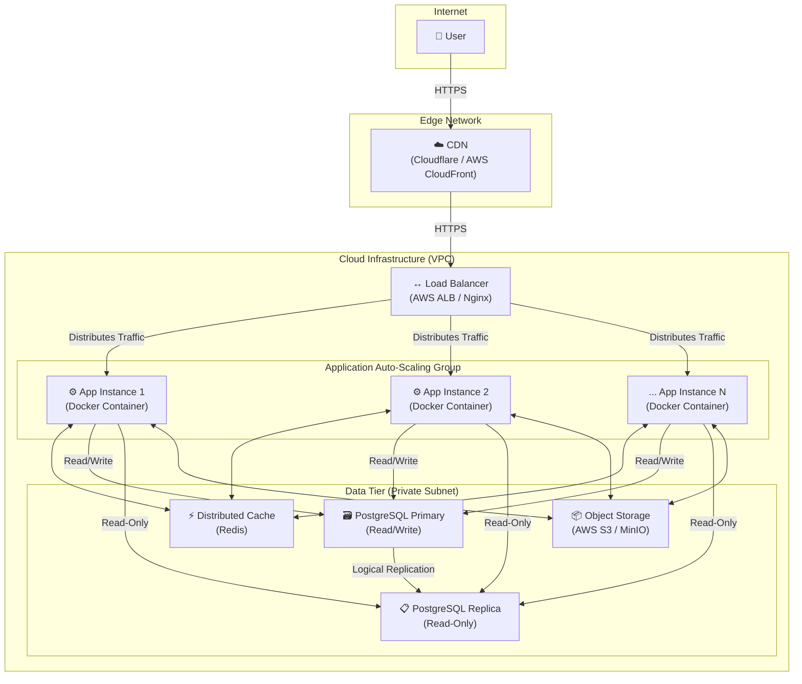

---

# **QuizMaster - Nền tảng Quiz Hiệu suất cao**

[](https://github.com)
[](https://opensource.org/licenses/MIT)

**QuizMaster** không chỉ là một ứng dụng Quiz thông thường. Đây là một dự án được xây dựng với tư duy về một hệ thống vững chắc, có khả năng đáp ứng lượng truy cập lớn. Dự án tuân thủ kiến trúc **"Well-Structured Monolith"** (Monolith có cấu trúc tốt), đảm bảo tốc độ phát triển nhanh trong giai đoạn đầu nhưng vẫn sẵn sàng cho việc mở rộng quy mô (scaling) trong tương lai.

## **Mục lục**

1.  [Tính năng Chính](#1-tính-năng-chính)
2.  [Stack Công nghệ](#2-stack-công-nghệ)
3.  [Sơ đồ Kiến trúc Hệ thống](#3-sơ-đồ-kiến-trúc-hệ-thống)
4.  [Phân tích Sâu về Kiến trúc (Architectural Deep Dive)](#4-phân-tích-sâu-về-kiến-trúc-architectural-deep-dive)
    *   [CDN (Content Delivery Network)](#cdn)
    *   [Load Balancer](#load-balancer)
    *   [Application Instances (Stateless Monolith)](#application-instances)
    *   [Database Cluster (Primary-Replica)](#database-cluster)
    *   [Distributed Cache (Redis)](#distributed-cache)
    *   [Object Storage (S3/MinIO)](#object-storage)
5.  [Lý giải Lựa chọn Thiết kế: Tại sao lại là Monolith?](#5-lý-giải-lựa-chọn-thiết-kế-tại-sao-lại-là-monolith)
6.  [Bắt đầu: Hướng dẫn Cài đặt Local](#6-bắt-đầu-hướng-dẫn-cài-đặt-local)
7.  [Quy trình Triển khai (Deployment)](#7-quy-trình-triển-khai-deployment)
8.  [Tài liệu API](#8-tài-liệu-api)

## **1. Tính năng Chính**

*   **Xác thực người dùng:** Đăng ký, đăng nhập an toàn sử dụng JWT.
*   **Làm Quiz:** Người dùng có thể tham gia các bài quiz, trả lời câu hỏi và nộp bài.
*   **Xem kết quả:** Hệ thống tự động chấm điểm và hiển thị kết quả chi tiết.
*   **Quản lý (Admin):** Tạo, cập nhật, xóa các bài quiz và câu hỏi.

## **2. Stack Công nghệ**

| Lĩnh vực | Công nghệ | Lý do lựa chọn |
| :--- | :--- | :--- |
| **Backend** | Java 17, Spring Boot 3.x | Hệ sinh thái mạnh mẽ, hiệu suất cao, cộng đồng lớn. |
| **Bảo mật** | Spring Security 6 + JWT | Tiêu chuẩn ngành để bảo mật REST API. |
| **Dữ liệu** | Spring Data JPA, Hibernate | Trừu tượng hóa tầng truy cập dữ liệu, giảm code boilerplate. |
| **Database** | PostgreSQL 15+ | Hệ quản trị CSDL quan hệ mạnh mẽ, đáng tin cậy, hỗ trợ tốt JSON. |
| **Cache** | Redis | Cache tốc độ cao cho session và dữ liệu thường xuyên truy cập. |
| **Build & Dependencies** | Maven | Quản lý project và thư viện một cách hiệu quả. |
| **DevOps** | Docker, Kubernetes (K8s) | Container hóa để nhất quán môi trường, điều phối để tự động scale. |
| **API Docs** | OpenAPI 3 (Swagger) | Tự động sinh tài liệu API, giúp việc tích hợp dễ dàng. |

## **3. Sơ đồ Kiến trúc Hệ thống**

Sơ đồ này mô tả cách các thành phần tương tác với nhau trong môi trường production để đảm bảo tính sẵn sàng cao và khả năng mở rộng.



---

### **4. Phân tích Sâu về Kiến trúc (Architectural Deep Dive)**

Tài liệu này trình bày một bản phân tích chi tiết về các quyết định thiết kế và lựa chọn công nghệ cho từng thành phần trong kiến trúc hệ thống QuizMaster. Mỗi thành phần được đánh giá dựa trên vai trò, lý do lựa chọn, và tác động của nó đến các mục tiêu kiến trúc tổng thể, bao gồm tính sẵn sàng cao, khả năng mở rộng, hiệu suất và an ninh.

#### **4.1. Lớp Biên (Edge Layer): Mạng lưới Phân phối Nội dung (CDN)**

*   **Mục đích & Vai trò Chiến lược:**
    Lớp Biên là điểm tiếp cận đầu tiên và là tuyến phòng thủ vòng ngoài của hệ thống. Vai trò của nó không chỉ dừng lại ở việc tăng tốc độ mà còn là một thành phần quan trọng trong chiến lược bảo mật và giảm tải cho hạ tầng lõi (origin infrastructure).

*   **Lựa chọn Công nghệ:** AWS CloudFront, tích hợp với AWS WAF & Shield.
    *   **Lý do:** Lựa chọn này cung cấp một hệ sinh thái tích hợp chặt chẽ, cho phép quản lý tập trung việc phân phối nội dung, bảo vệ chống DDoS và lọc lưu lượng truy cập ở Lớp 7 thông qua một giao diện duy nhất. Mạng lưới toàn cầu của AWS đảm bảo độ trễ thấp cho người dùng trên toàn thế giới.

*   **Lý giải Kỹ thuật & Tác động:**
    1.  **Tối ưu hóa Hiệu suất Truyền tải:** Bằng việc lưu trữ (cache) các tài sản tĩnh (CSS, JavaScript, hình ảnh) tại các máy chủ biên (Edge Locations), CDN giảm đáng kể khoảng cách vật lý giữa dữ liệu và người dùng cuối. Điều này trực tiếp cải thiện các chỉ số hiệu suất quan trọng như Time to First Byte (TTFB), giúp trang web tải nhanh hơn và nâng cao trải nghiệm người dùng.
    2.  **Giảm tải cho Máy chủ Gốc (Origin Offloading):** Một phần lớn lưu lượng truy cập vào hệ thống là các yêu cầu lặp đi lặp lại cho các tài sản tĩnh. CDN xử lý các yêu cầu này tại biên, ngăn chúng tiếp cận lớp ứng dụng. Việc "dỡ tải" này cho phép các máy chủ ứng dụng quý giá dành tài nguyên CPU, bộ nhớ và băng thông mạng để xử lý các logic nghiệp vụ động, qua đó tăng năng lực xử lý giao dịch thực tế của toàn hệ thống.
    3.  **Tăng cường Vành đai An ninh (Security Perimeter Enhancement):** Tích hợp với AWS Shield cung cấp khả năng bảo vệ tự động, luôn bật chống lại các cuộc tấn công DDoS phổ biến ở Lớp 3 và Lớp 4. Tích hợp với AWS WAF cho phép định nghĩa các quy tắc để lọc và chặn các cuộc tấn công ở Lớp 7, chẳng hạn như SQL injection và Cross-Site Scripting (XSS), trước khi chúng có cơ hội khai thác lỗ hổng của ứng dụng.

*   **Cân nhắc Vận hành:**
    Cần xây dựng một chiến lược vô hiệu hóa cache (Cache Invalidation Strategy) rõ ràng. Việc triển khai các phiên bản mới của frontend đòi hỏi phải có cơ chế tự động để xóa cache của các tệp tin đã thay đổi trên CDN, đảm bảo người dùng không gặp phải các lỗi do sử dụng phiên bản cũ.

#### **4.2. Lớp Phân phối Tải (Distribution Layer): Bộ Cân bằng Tải Ứng dụng**

*   **Mục đích & Vai trò Chiến lược:**
    Đây là thành phần trung tâm điều phối và phân phối lưu lượng truy cập một cách thông minh và linh hoạt đến các máy chủ ứng dụng. Nó không chỉ là một bộ chia tải đơn thuần mà còn là một công cụ đảm bảo tính sẵn sàng và đàn hồi của hệ thống.

*   **Lựa chọn Công nghệ:** AWS Application Load Balancer (ALB).
    *   **Lý do:** ALB là một dịch vụ cân bằng tải Lớp 7 được quản lý, có khả năng định tuyến dựa trên nội dung (content-based routing) như đường dẫn URL hoặc tên miền phụ. Quan trọng hơn, nó tích hợp sâu với các dịch vụ cốt lõi khác của AWS như Auto Scaling Groups và Certificate Manager, đơn giản hóa đáng kể việc vận hành.

*   **Lý giải Kỹ thuật & Tác động:**
    1.  **Đảm bảo Tính sẵn sàng Cao (High Availability):** ALB liên tục thực hiện các kiểm tra sức khỏe (Health Checks) tới các instance ứng dụng theo một tần suất và ngưỡng được định cấu hình. Nếu một instance không vượt qua kiểm tra (ví dụ: do ứng dụng bị treo, server quá tải), ALB sẽ ngay lập tức ngừng gửi lưu lượng truy cập mới đến nó và định tuyến lại cho các instance còn lại. Cơ chế này loại bỏ điểm lỗi đơn (Single Point of Failure) ở lớp ứng dụng và cho phép hệ thống tự động phục hồi sau sự cố cục bộ.
    2.  **Kích hoạt Khả năng Mở rộng Đàn hồi (Elastic Scalability Enabler):** ALB là điều kiện tiên quyết cho việc mở rộng theo chiều ngang. Khi được kết hợp với Auto Scaling Groups, hệ thống có thể tự động thêm (scale-out) hoặc bớt (scale-in) các instance ứng dụng dựa trên các chỉ số thời gian thực như tải CPU hoặc số lượng request. ALB sẽ tự động đăng ký các instance mới và bắt đầu phân phối tải cho chúng, giúp hệ thống thích ứng linh hoạt với sự biến động của lưu lượng truy cập.
    3.  **Tối ưu hóa Xử lý Mã hóa (SSL/TLS Termination):** ALB đảm nhận nhiệm vụ giải mã lưu lượng HTTPS (một quá trình tiêu tốn nhiều CPU) trước khi chuyển tiếp yêu cầu đến các instance ứng dụng dưới dạng HTTP không mã hóa trong một mạng riêng ảo an toàn (VPC). Điều này giải phóng tài nguyên tính toán trên các máy chủ ứng dụng, cho phép chúng tập trung hoàn toàn vào việc thực thi logic nghiệp vụ.

#### **4.3. Lớp Ứng dụng (Application Layer): Nền tảng Monolith Phi trạng thái**

*   **Mục đích & Vai trò Chiến lược:**
    Đây là "bộ não" của hệ thống, nơi thực thi toàn bộ logic nghiệp vụ. Kiến trúc của lớp này được thiết kế để trở thành một khối đơn vị (monolith) nhất quán, nhưng có thể nhân bản và thay thế (disposable), tuân thủ nguyên tắc phi trạng thái (statelessness).

*   **Lựa chọn Công nghệ:** Ứng dụng Spring Boot, được container hóa bằng Docker và điều phối bởi Kubernetes (hoặc AWS ECS).

*   **Lý giải Kỹ thuật & Tác động:**
    1.  **Thiết kế Phi trạng thái (Stateless Design):** Đây là nguyên tắc kiến trúc nền tảng. Mỗi instance ứng dụng là hoàn toàn độc lập và không lưu trữ bất kỳ dữ liệu phiên (session) hoặc dữ liệu cụ thể nào của người dùng. Mọi trạng thái cần thiết đều được ngoại vi hóa (externalized) sang các dịch vụ chuyên dụng như Redis (cho session) và S3 (cho file). Triết lý này biến mỗi instance thành một "công nhân" có thể thay thế, cho phép hệ thống mở rộng, thu hẹp và tự phục hồi một cách liền mạch mà không làm mất dữ liệu của người dùng.
    2.  **Container hóa với Docker (Immutable Infrastructure):** Ứng dụng và toàn bộ môi trường chạy của nó được đóng gói vào một Docker image không thể thay đổi (immutable). Image này trở thành một "đóng dấu vàng" (golden stamp), đảm bảo tính nhất quán tuyệt đối giữa môi trường phát triển, kiểm thử và sản phẩm. Nó loại bỏ rủi ro do sự khác biệt về cấu hình môi trường và đơn giản hóa quy trình triển khai thành một hành động nguyên tử: chạy một container từ một image đã được xác minh.
    3.  **Điều phối Động (Dynamic Orchestration):** Các nền tảng như Kubernetes tự động hóa vòng đời của các container. Nó không chỉ khởi chạy chúng mà còn quản lý mạng lưới, giám sát sức khỏe, tự động khởi động lại các container bị lỗi (self-healing), và thực hiện các chiến lược triển khai phức tạp như Rolling Updates (cập nhật dần dần từng instance để không gây gián đoạn dịch vụ) và Canary Deployments (triển khai cho một nhóm nhỏ người dùng trước).

#### **4.4. Lớp Dữ liệu (Data Layer): Kho lưu trữ Đa mô hình Chuyên dụng**

*   **Mục đích & Vai trò Chiến lược:**
    Lớp dữ liệu được thiết kế theo nguyên tắc "chọn công cụ phù hợp cho từng công việc", tránh sử dụng một giải pháp duy nhất cho mọi loại dữ liệu. Nó bao gồm nhiều hệ thống lưu trữ khác nhau, mỗi hệ thống được tối ưu hóa cho một loại workload cụ thể.

*   **Phân tích Chi tiết các Thành phần:**

    1.  **Cơ sở dữ liệu Quan hệ (PostgreSQL - Primary/Replica):**
        *   **Vai trò:** Là nguồn chân lý (Source of Truth) cho các dữ liệu giao dịch có cấu trúc cao, đòi hỏi tính nhất quán ACID (Atomicity, Consistency, Isolation, Durability).
        *   **Kiến trúc:** Mô hình Primary-Replica được triển khai để giải quyết bài toán workload đọc-nhiều. Primary instance xử lý tất cả các hoạt động ghi, đảm bảo tính nhất quán mạnh mẽ. Các Replica instance được đồng bộ hóa không đồng bộ (asynchronously) từ Primary và chỉ phục vụ các truy vấn đọc. Kiến trúc này cho phép scale khả năng đọc của hệ thống một cách độc lập bằng cách thêm các replica mới, qua đó bảo vệ hiệu suất của các giao dịch ghi quan trọng.

    2.  **Bộ nhớ đệm Phân tán (Redis):**
        *   **Vai trò:** Là một kho lưu trữ key-value trong bộ nhớ, cung cấp khả năng truy cập dữ liệu với độ trễ cực thấp (sub-millisecond).
        *   **Ứng dụng:**
            a. **Kho lưu trữ Session (Session Store):** Hỗ trợ kiến trúc stateless của lớp ứng dụng bằng cách cung cấp một nơi tập trung, nhanh chóng để lưu trữ và truy xuất thông tin phiên đăng nhập.
            b. **Bộ đệm Đa cấp (Multi-level Caching):** Giảm tải trực tiếp cho CSDL bằng cách cache các đối tượng dữ liệu được truy cập thường xuyên hoặc kết quả của các truy vấn tốn kém. Việc này tạo ra một "đường tắt" hiệu suất cao, giúp cải thiện đáng kể thời gian phản hồi của API và giảm chi phí vận hành CSDL.

    3.  **Lưu trữ Đối tượng (AWS S3):**
        *   **Vai trò:** Kho lưu trữ bền vững, có khả năng mở rộng gần như vô hạn cho các dữ liệu nhị phân không có cấu trúc (BLOBs - Binary Large Objects).
        *   **Lý giải:** Việc lưu trữ các tệp tin (hình ảnh, video) trực tiếp trong CSDL quan hệ là một anti-pattern vì nó làm tăng nhanh kích thước CSDL, phức tạp hóa việc sao lưu/phục hồi, và làm giảm hiệu suất chung. S3 được thiết kế chuyên biệt cho mục đích này, cung cấp độ bền dữ liệu lên tới 99.999999999% (11 số 9), chi phí lưu trữ thấp và băng thông truy cập cao.
## **5. Lý giải Lựa chọn Thiết kế: Tại sao lại là Monolith?**

Trong thế giới tôn vinh Microservices, việc lựa chọn Monolith là một quyết định kỹ thuật có chủ đích, đặc biệt phù hợp cho giai đoạn đầu và giữa của dự án.

1.  **Tốc độ Phát triển (Development Velocity):** Một codebase duy nhất giúp giảm sự phức tạp trong việc thiết lập môi trường, debug, và triển khai. Team có thể tập trung 100% vào việc xây dựng tính năng và đưa sản phẩm ra thị trường nhanh hơn.
2.  **Đơn giản trong Vận hành (Operational Simplicity):** Quản lý và giám sát một ứng dụng đơn giản hơn nhiều so với việc phải duy trì một hệ sinh thái gồm nhiều services, network, và các cơ chế giao tiếp phức tạp.
3.  **Hiệu năng Cao (Out-of-the-box Performance):** Giao tiếp giữa các module bên trong monolith là các lời gọi phương thức trực tiếp (in-memory), có độ trễ gần như bằng không, so với các lời gọi mạng (network overhead) trong Microservices.
4.  **Đây không phải là ngõ cụt:** Nhờ cấu trúc module rõ ràng (tách biệt theo domain) và kiến trúc triển khai stateless, khi hệ thống phát triển đủ lớn, chúng ta có thể **tiến hóa** một cách từ từ, tách các module quan trọng ra thành Microservices riêng mà không cần phải viết lại toàn bộ hệ thống.

> **Triết lý:** "Bắt đầu với Monolith, tách ra thành Microservices chỉ khi nỗi đau do Monolith gây ra lớn hơn nỗi đau do Microservices mang lại."

## **6. Bắt đầu: Hướng dẫn Cài đặt Local**

#### **Yêu cầu:**
*   Java JDK 17+
*   Apache Maven 3.8+
*   Docker & Docker Compose

#### **Các bước cài đặt:**
1.  **Clone repository:**
    ```bash
    git clone https://your-repo-url.git
    cd quizmaster-app
    ```

2.  **Cấu hình Môi trường:**
    Tạo một file `.env` từ file mẫu để cấu hình các biến môi trường cho Docker.
    ```bash
    cp .env.example .env
    ```
    *Mở file `.env` và tùy chỉnh các giá trị nếu cần (VD: `POSTGRES_PASSWORD`).*

3.  **Khởi chạy các Dịch vụ Nền (Database & Cache):**
    Lệnh này sẽ khởi chạy PostgreSQL và Redis trong các container Docker.
    ```bash
    docker-compose up -d
    ```
    *`-d` để chạy ở chế độ nền (detached).*

4.  **Chạy ứng dụng Spring Boot:**
    Ứng dụng sẽ đọc cấu hình từ file `src/main/resources/application.yml` để kết nối đến các dịch vụ trong Docker.
    ```bash
    mvn spring-boot:run
    ```

5.  **Truy cập ứng dụng:**
    *   **Ứng dụng:** `http://localhost:8080`
    *   **Tài liệu API (Swagger UI):** `http://localhost:8080/swagger-ui.html`

## **7. Quy trình Triển khai (Deployment)**

Quy trình triển khai được tự động hóa thông qua CI/CD (Continuous Integration/Continuous Deployment).

1.  **Commit & Push:** Developer push code lên nhánh `main` (hoặc tạo Pull Request).
2.  **CI (Continuous Integration):**
    *   Một dịch vụ CI (GitHub Actions, Jenkins) sẽ tự động được kích hoạt.
    *   Nó sẽ build code, chạy toàn bộ unit test và integration test.
3.  **Build & Push Image:** Nếu CI thành công, một Docker image mới sẽ được build và đẩy lên một Container Registry (AWS ECR, Docker Hub).
4.  **CD (Continuous Deployment):**
    *   Một hệ thống CD (ArgoCD, Spinnaker) sẽ nhận diện image mới.
    *   Nó sẽ thực hiện một "Rolling Update" trên môi trường Production (Kubernetes), cập nhật các instance một cách từ từ mà không gây gián đoạn dịch vụ.

## **8. Tài liệu API**

Tài liệu API được tự động tạo bằng OpenAPI 3. Sau khi chạy ứng dụng, bạn có thể truy cập và tương tác với các endpoint tại:

**[http://localhost:8080/swagger-ui.html](http://localhost:8080/swagger-ui.html)**
