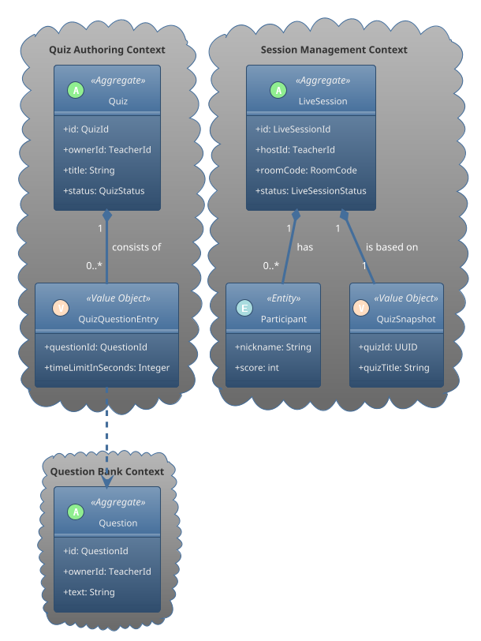

---

# **Quizz App - Phase 1: Technical Design Documentation**

**Version:** 1.0  
**Status:** Approved for Development

This document provides the complete technical design for Phase 1 of the Quizz App project. The primary goal of this phase is to deliver a robust and functional **Live Quiz (Game Mode)** as a Minimum Viable Product (MVP).

The design is based on **Domain-Driven Design (DDD)**, a **Layered Architecture**, and a **CQRS**-inspired approach to data management, ensuring a scalable, maintainable, and testable system.

## 1. High-Level Architecture

The system is built on a 4-layer architecture, with a clear separation of concerns. Real-time communication is decoupled from the core business logic via a Redis Pub/Sub message bus.


*(Bạn có thể thay thế link này bằng hình ảnh kiến trúc thực tế của mình)*

1.  **Presentation Layer:** Handles HTTP (REST APIs) and WebSocket connections. It is the entry point for all client interactions.
2.  **Application Layer:** Orchestrates use cases. It contains no business logic but coordinates the flow between the presentation and domain layers.
3.  **Domain Layer:** The heart of the application. It contains all business logic, rules, and state, modeled as Aggregates.
4.  **Infrastructure Layer:** Provides technical implementations, such as database repositories, Redis publishers/subscribers, and other external service integrations.

## 2. Phase 1 Core Domain Model

The domain for Phase 1 is focused on three core aggregates that work together to deliver the live quiz experience.

### 2.1. Bounded Contexts & Aggregates

-   **Question Bank Context:** Manages reusable content.
    -   **`Question` Aggregate:** Represents a single, independent question with its text, options, and answer.
-   **Quiz Authoring Context:** Manages the structure of an assessment.
    -   **`Quiz` Aggregate:** Represents a structured collection of references to `Question`s, along with specific settings.
-   **Session Management Context:** Manages the real-time execution of a quiz.
    -   **`LiveSession` Aggregate:** Represents a live game session, managing its state from the lobby to the final results.

### 2.2. Domain Model Diagram

This diagram shows the three core aggregates and their most important components.



### 2.3. Key Domain Design Decisions

-   **`Question` as a separate Aggregate:** Maximizes content reusability and enables a centralized "Question Bank".
-   **`Quiz` references `Question`s by ID:** Keeps the `Quiz` aggregate lightweight and ensures that updates to a `Question` are automatically reflected.
-   **`QuizSnapshot` for Sessions:** A `LiveSession` creates an immutable copy of the quiz data when it starts. This is a critical feature to ensure the game's integrity, preventing it from being affected by mid-game edits to the source `Quiz`.

---

## 3. Production-Ready Database Design (PostgreSQL)

The database schema is designed with production requirements like auditing, soft deletes, and query performance in mind.

### 3.1. Design Philosophy

-   **Write/Read Segregation:** Separate tables for persisting aggregates (Write-Side) and for serving UI queries (Read-Side).
-   **Auditing & Soft Deletes:** Critical tables include `created_at`, `updated_at`, and a nullable `deleted_at` timestamp for tracking and recovery.
-   **Advanced Indexing:** Utilizes GIN indexes for JSONB searching and Partial Indexes for complex uniqueness constraints.

### 3.2. Write-Side Schema (Aggregate Persistence)

These tables are the transactional source of truth.

```mermaid
erDiagram
    users {
        UUID id PK
        VARCHAR email UNIQUE
        VARCHAR role
        TIMESTAMPTZ created_at
        TIMESTAMPTZ deleted_at
    }

    questions {
        UUID id PK
        UUID owner_id FK
        TEXT text
        JSONB options
        JSONB metadata
    }

    quizzes {
        UUID id PK
        UUID owner_id FK
        VARCHAR title
        JSONB question_entries
    }

    live_sessions {
        UUID id PK
        UUID host_id FK
        VARCHAR room_code
        JSONB quiz_snapshot
    }

    users ||--o{ questions : owns
    users ||--o{ quizzes : owns
    users ||--o{ live_sessions : hosts
```

-   **`users`, `questions`, `quizzes`:** All include auditing and soft delete columns. The `questions` table has a GIN index on its `metadata` JSONB column for efficient tag-based searching.
-   **`live_sessions`**: Features a **partial unique index** on `room_code` that only applies to sessions not in the `FINISHED` state. This allows room codes to be safely reused over time.

### 3.3. Read-Side Schema (Query Projections)

These denormalized tables are optimized for specific UI views to ensure fast, non-blocking reads.

-   **`quiz_summaries`**: Powers the teacher's dashboard. Contains pre-calculated fields like `question_count` and `tags` to support fast loading, searching, and filtering.
-   **`quiz_details`**: Powers the detailed view/edit page for a single quiz. It stores a fully denormalized `questions_data` (JSONB) field, allowing the entire page to be rendered with a single, fast database lookup.
-   **`session_results`**: Caches the final outcome of a session, including the full leaderboard, for quick access to historical reports.

---

## 4. Phase 1 Scope Summary

In addition to the core domain and database, Phase 1 includes the following essential components to create a complete, end-to-end user journey:

| Category | Component | Rationale |
| :--- | :--- | :--- |
| **User Mgmt** | `User` Aggregate & Basic Auth | Provides user registration/login and role-based access (`TEACHER`, `STUDENT`). |
| **Security** | Spring Security + JWT | Secures all API endpoints and WebSocket connections. |
| **Real-time** | WebSocket + Redis Pub/Sub | The core engine for the "live" experience, decoupling real-time notifications from business logic. |
| **Persistence** | PostgreSQL + Flyway | Ensures durable data storage and systematic schema management. |
| **API** | Teacher & Student Dashboards (Read Models) | Provides the necessary entry points and data views for users to interact with the system. |
| **UX** | Global Exception Handling | Delivers consistent and user-friendly error responses. |