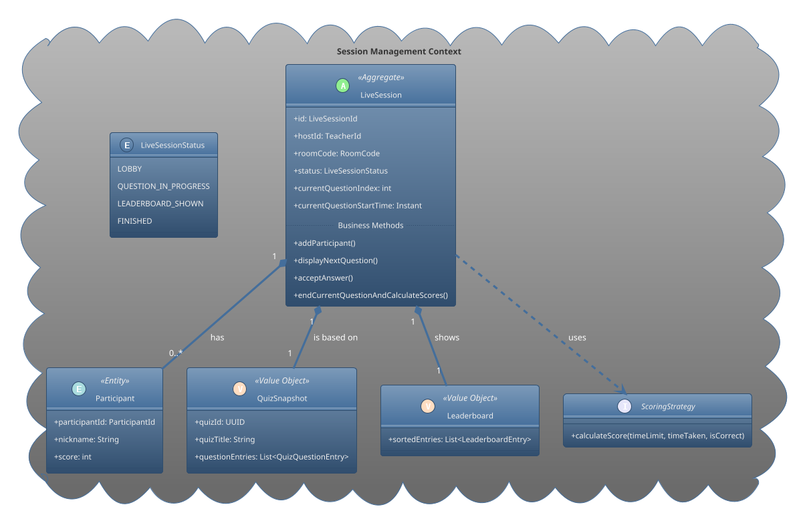

---

# **Domain Design: Live Quiz (Game Mode)**

This document outlines the domain design for the **Live Quiz (Game Mode)** feature, which is part of the broader **Session Management Bounded Context**. The design is centered around a robust `LiveSession` aggregate that manages the entire lifecycle of a real-time, interactive quiz game.

## 1. Core Principles

The design for the Live Game Mode is guided by the following principles:

-   **Transactional Consistency:** The state of a single game session (participants, scores, current question) must always be consistent. The `LiveSession` aggregate acts as the consistency boundary.
-   **Encapsulation:** All business rules and logic governing the game's flow are encapsulated within the aggregate, protecting its integrity.
-   **Immutability and Isolation:** Once a session starts, it must be isolated from external changes (e.g., edits to the source quiz). This is achieved through the use of snapshots.
-   **Flexibility:** Core logic, such as scoring, is decoupled from the aggregate to allow for future extensibility without modifying the aggregate itself.

## 2. The `LiveSession` Aggregate

The `LiveSession` is the single aggregate root responsible for an entire interactive quiz game. It controls the flow from the initial lobby, through each question-and-answer cycle, to the final results.

-   **Key Responsibilities:**
    -   Managing the session's lifecycle through a well-defined state machine (`LOBBY`, `QUESTION_IN_PROGRESS`, etc.).
    -   Enforcing host-only privileges for critical actions (e.g., starting the game, advancing to the next question).
    -   Managing the list of participants and their state (e.g., current score, submitted answer).
    -   Validating incoming actions against game rules (e.g., rejecting answers submitted after the time limit).
    -   Orchestrating score calculation and updating the leaderboard.

### 2.1. Internal Components and Key Decisions

#### **`Participant` (Internal Entity)**
Represents a player within the session. Its state is managed exclusively by the `LiveSession` aggregate. It holds the participant's nickname, total score, and their transient answer for the current round.

#### **`QuizSnapshot` (Value Object) - A Critical Optimization**
To ensure game integrity, a session cannot rely on a live reference to a `Quiz` that might be modified while the game is in progress.
-   **Solution:** When a `LiveSession` is created, it takes an immutable **snapshot** of the source quiz. This `QuizSnapshot` is a Value Object containing all necessary information for the session's duration (question text, options, correct answers, time limits, etc.).
-   **Benefit:** This makes the `LiveSession` aggregate entirely self-contained and immune to external changes, guaranteeing a fair and consistent experience for all participants.

#### **`Leaderboard` (Value Object)**
An immutable representation of the game's rankings at a specific point in time, typically after a question round is completed.

#### **`ScoringStrategy` (Strategy Pattern)**
The logic for calculating points can vary (e.g., based on speed, correctness only, etc.). To keep the `LiveSession` aggregate clean and flexible:
-   **Solution:** We define a `ScoringStrategy` interface. The `LiveSession`'s scoring method accepts an implementation of this strategy.
-   **Benefit:** New scoring models can be introduced without altering the core `LiveSession` aggregate, adhering to the Open/Closed Principle.

### 2.2. Domain Model Diagram

This design provides a robust and scalable foundation for the live quiz feature, ensuring consistency, flexibility, and a clear separation of concerns.