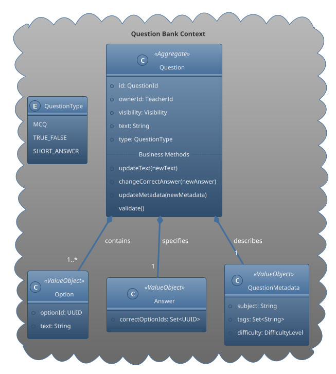
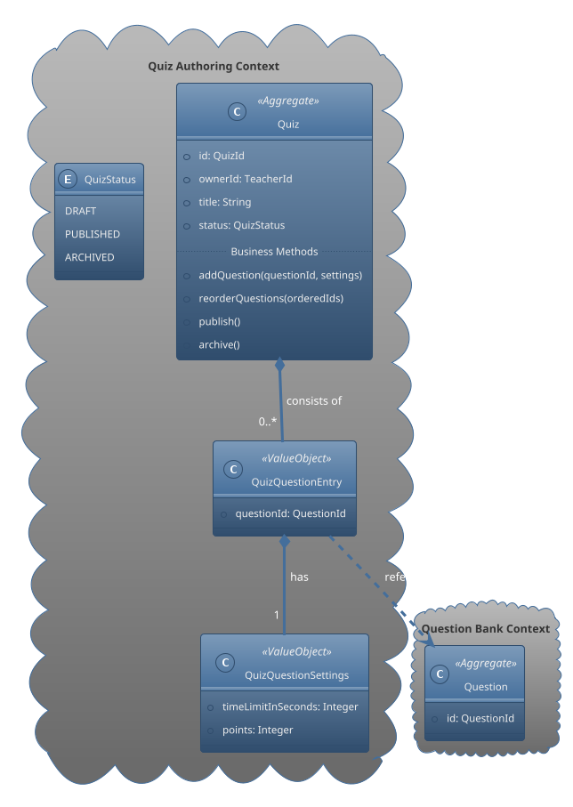

---

# **Quiz Management Domain Design**

This document details the domain design for the **Quiz Management** bounded context. The design adheres to Domain-Driven Design (DDD) principles, focusing on creating a robust, flexible, and maintainable model that accurately reflects the business requirements of creating and managing educational quizzes.

## 1. Core Design Philosophy

The Quiz Management context is intentionally split into two distinct, smaller bounded contexts. This separation is a critical design decision that promotes high cohesion, low coupling, and clear business responsibilities.

1.  **Question Bank Context:** Focuses entirely on the **content**. It treats each question as an independent, reusable asset.
2.  **Quiz Authoring Context:** Focuses on the **structure and orchestration**. It assembles quizzes by referencing content from the Question Bank.

This approach prevents the creation of a large, monolithic "Quiz" object, solving key challenges related to content reusability, centralized management, and performance.

---

## 2. Question Bank Context

The `Question Bank` is the foundational content library for the entire application. It allows teachers to create, manage, and categorize individual questions that can later be used in multiple quizzes.

### 2.1. Aggregate: `Question`

The `Question` is the central aggregate root of this context. It encapsulates all data, state, and business rules related to a single question.

-   **Responsibilities:**
    -   Ensuring the integrity of a question's content (e.g., a Multiple Choice question must have options and a correct answer).
    -   Managing its lifecycle and metadata (e.g., difficulty, subject, tags).
    -   Controlling its visibility and ownership.

### 2.2. Domain Model Diagram

-   **`Question` (Aggregate Root):** The core object. It ensures that any changes maintain a valid state.
-   **`Option`, `Answer`, `QuestionMetadata` (Value Objects):** These are immutable objects that describe the properties of a `Question`. They have no identity of their own and are intrinsically part of the aggregate.

---

## 3. Quiz Authoring Context

The `Quiz Authoring` context allows teachers to assemble questions from the Question Bank into a structured, publishable test or assessment.

### 3.1. Aggregate: `Quiz`

The `Quiz` is the aggregate root here. Its primary role is to manage the structure, settings, and lifecycle of an assessment. **Crucially, it does not own the question content; it only references it.**

-   **Responsibilities:**
    -   Maintaining an ordered list of questions.
    -   Allowing customization of question behavior (e.g., time limits, points) specifically for this quiz.
    -   Managing its lifecycle state (`DRAFT`, `PUBLISHED`, `ARCHIVED`).

### 3.2. Domain Model Diagram

-   **`Quiz` (Aggregate Root):** Manages the collection of question entries and the quiz's overall state.
-   **`QuizQuestionEntry` (Value Object):** A critical component that links a `Quiz` to a `Question` via `QuestionId`. It also holds settings specific to that question's appearance in this quiz.
-   **`QuizQuestionSettings` (Value Object):** Allows a teacher to override default behaviors (like time limits or points) for a question within the context of a single quiz, without altering the original question in the Question Bank.

## 4. Key Design Decisions & Benefits

1.  **Separation of Content and Structure:** By separating `Question` and `Quiz` into different aggregates, we achieve:
    -   **Maximum Reusability:** A single `Question` can be included in countless `Quiz` instances.
    -   **Centralized Management:** Edits to a `Question` (e.g., fixing a typo) are instantly reflected in all quizzes that use it.
    -   **Improved Performance:** Loading a `Quiz` aggregate is lightweight, as it only loads a list of IDs, not the full content of every question.

2.  **Context-Specific Customization:** The `QuizQuestionEntry` and `QuizQuestionSettings` value objects provide flexibility. A question can be worth 10 points in an easy quiz but 25 points in a final exam, all without duplicating the core question content.

3.  **Clear Aggregate Boundaries:** Each aggregate has a clear responsibility and boundary, simplifying business logic and ensuring transactional consistency where it matters most. For example, the list of questions within a quiz is always consistent, but the link to the question content itself is eventually consistent.
